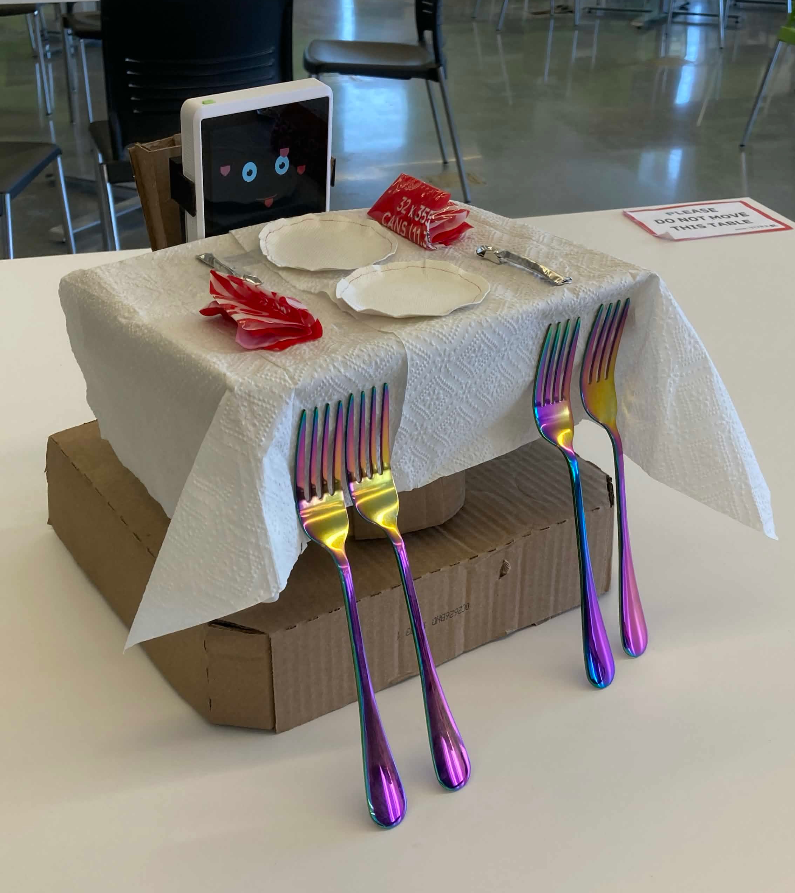

# Object-Love-Interface 💘

> **🥇 Best Useless Hack** — CTRL+HACK+DEL 2.0 (York University)

What if you could go on a date with... literally any object?

Place an object in front of the camera. OLI scans it. Suddenly your bowl of ramen has a personality, a voice, opinions, and emotional availability. Using **Google Gemini API** to generate personalities and **ElevenLabs** to give them voices, we turned random objects into emotionally available Valentine's dates—all running on **Raspberry Pi** plus **three different ESP32 devices**.



---

## 🏗️ System Architecture

A sophisticated multi-device IoT system bridging:
- **AI Generation** (Google Gemini 2.0 Flash) — personality description from image
- **Speech Synthesis** (ElevenLabs) — voices with emotion and character
- **Real-Time Display Sync** — synchronized animations across heterogeneous hardware

### Hardware Stack
| Device | Purpose | Interface | MCU |
|--------|---------|-----------|-----|
| **SenseCAP Indicator D1101** | Display + haptic feedback | USB Serial (921600 baud) | ESP32-S3 + RP2040 |
| **M5Stack Core** | WiFi audio speaker | HTTP (port 8082) | ESP32 |
| **Raspberry Pi 4/5** | Orchestrator brain | GPIO, USB, WiFi | ARM Cortex-A72 |
| **Brio Webcam** | Video + microphone input | USB | — |
| **Servo Motor** | Physical expression | GPIO serial | — |

### Software Stack

**Backend (Python 2440 LOC)**
- **OpenCV** — webcam capture (30 FPS video streaming)
- **PySerial** — USB serial protocol for SenseCAP (JPEG transfer, command/response)
- **PyAudio** — microphone input & voice recording
- **requests** — HTTP orchestration to Node.js server
- **google-generativeai** — Gemini API (personality generation)
- **pydub** — audio encoding/transcoding

**Frontend/Server (Node.js)**
- **Express.js** — HTTP API server (:3000)
- **@google/generative-ai** — Gemini 2.0 Flash for text generation
- **@elevenlabs/elevenlabs-js** — TTS voice synthesis with emotion
- **WebSocket (ws)** — real-time communication
- **multer** — file upload handling
- **dotenv** — environment secrets management

**Firmware (PlatformIO)**
- **ESP32-S3** — RGB LCD driver (ST7701S), JPEG decoding, touch input
- **RP2040** — buzzer control via UART, melody synthesis
- **ESP32** (M5Stack) — WiFi stack, ESP8266Audio library, internal DAC

---

## 🔄 Core Data Flow

### Image → Personality → Synchronized Playback (5-15s)

```
┌─ Webcam Frame (OpenCV, 30 FPS)
│
├─ Encode JPEG (Pillow)
│  └─ Send to SenseCAP display (USB serial, 921600 baud)
│
├─ Draw UI overlay (pink "Date ♥" button)
│
├─ Wait for button press (GPIO17 interrupt or SenseCAP touch)
│
├─ On trigger:
│  ├─ Save frame to disk
│  │
│  ├─ POST to Node.js: /generate-personality {image_b64}
│  │  └─ Google Gemini API (2-5s)
│  │     └─ Generate personality text + voice selection
│  │
│  ├─ ElevenLabs TTS synthesis (3-8s)
│  │  └─ Generate MP3 with emotion/character
│  │
│  ├─ Send face JPEG to SenseCAP (serial)
│  │
│  ├─ POST to M5Stack: /play {audio_url}
│  │  └─ M5 fetches MP3 via WiFi HTTP GET
│  │
│  ├─ mouth_sync.py: Poll M5 /status every 16ms
│  │  └─ Map audio position → mouth shape keyframe (0-8 frames)
│  │  └─ Resend JPEG with updated mouth to SenseCAP
│  │  └─ Stop at ~70% duration (character reaction)
│  │
│  └─ Return to video feed
```

### Voice Conversation Loop

```
Button Held (GPIO18 interrupt)
    ↓
Record microphone audio (PyAudio, 16-bit PCM @ device rate)
    ↓
Button Released
    ↓
Encode WAV → MP3 (pydub)
    ↓
POST to Node.js: /respond {audio_b64, context}
    ↓
Node:
  • Google Cloud Speech-to-Text (transcription)
  • Gemini API (contextual response using conversation history)
  • ElevenLabs TTS (emotion-aware voice synthesis)
  ↓
Python:
  • Fetch MP3 URL from response
  • POST to M5Stack: /play {audio_url}
  • mouth_sync.py: Sync mouth animation with audio
  • Update conversation context
  ↓
Return to video feed (ready for next interaction)
```

---

## 📁 Project Structure

```
Object-Love-Interface/
├── README.md (this file)
├── plan-rpiMigration.md          # Windows → Raspberry Pi migration guide
├── demo_script.md                # Demonstration walkthrough
│
├── Screen/                        # SenseCAP Indicator (ESP32-S3 + RP2040)
│   ├── esp32s3_firmware/         # PlatformIO: LCD driver + JPEG decoder
│   ├── rp2040_firmware/          # PlatformIO: Buzzer + melody control
│   └── controller/               # Python serial protocol library
│       ├── sensecap_controller.py  # Full serial API
│       ├── test_display.py        # RGB test pattern
│       ├── test_image.py          # JPEG encoding test
│       └── quick_test.py          # Integration test
│
├── Audio/                         # M5Stack Core (ESP32 WiFi Speaker)
│   ├── m5core2_firmware/         # PlatformIO: WiFi + audio DAC
│   │   ├── platformio.ini
│   │   └── src/main.cpp          # HTTP API + ESP8266Audio
│   └── README.md                 # HTTP API documentation
│
├── pipeline/                      # Main orchestrator (2440 LOC Python)
│   ├── date_pipeline.py          # (672 L) Video feed → button → personality
│   ├── conversation.py           # (495 L) Voice recording + AI responses
│   ├── mouth_sync.py             # (334 L) Audio position → mouth animation
│   ├── orchestrator.py           # (273 L) Multi-module coordination
│   ├── audio_server.py           # (189 L) Flask HTTP server
│   ├── gpio_button.py            # (140 L) GPIO interrupt handling
│   ├── wifi_link.py              # (215 L) WiFi TCP client for SenseCAP
│   ├── servo_serial.py           # (86 L) Servo motor control
│   ├── requirements.txt           # pip dependencies
│   └── README.md
│
├── image_to_voice/               # Node.js AI + TTS server
│   ├── index.js                  # Express server + Gemini + ElevenLabs
│   ├── package.json              # npm dependencies (express, generative-ai, elevenlabs)
│   ├── .env                      # API keys (gitignored)
│   ├── tmp/                      # Generated MP3 files (served over HTTP)
│   └── helper/                   # State management
│       ├── personality.js        # Personality persistence
│       ├── context.js            # Conversation history (multi-turn)
│       ├── interest.js           # Interest tracking
│       ├── voice.js              # Voice variant selection
│       └── dateStats.js          # Date interaction statistics
│
├── Media/                         # Test media files
│   └── IMG_7700.jpg              # Physical device photo
├── CAD/                           # Hardware designs
└── esp32_main/                   # Legacy ESP32 firmware
```

---

## ⚙️ Technical Implementation Details

### Serial Protocol (SenseCAP ↔ Raspberry Pi)

**Baud Rate**: 921600 (optimized for JPEG throughput)

**Command Format**: JSON-terminated newline, UTF-8 encoded

```json
// Image transfer (3-step handshake)
{"cmd":"image","len":65536}        // Announce size
[wait: {"status":"ready"}]         // Device ready
[send 65536 raw JPEG bytes]        // Binary image data
[wait: {"status":"ok"}]            // Transfer complete

// Buzzer control
{"cmd":"tone","freq":1000,"dur":500}        // Single tone
{"cmd":"melody","notes":"440:200,554:200"}  // Comma-separated freq:duration

// Display control
{"cmd":"clear","color":"#FF00FF"}   // Fill background
{"cmd":"bl","on":true}              // Backlight control
```

### HTTP API (Node.js Server)

**Base URL**: `http://<HOST_IP>:3000`

| Endpoint | Method | Input | Output | Latency |
|----------|--------|-------|--------|---------|
| `/generate-personality` | POST | `{image_b64, camera_index}` | `{personality, voice_id, interest}` | 2-5s (Gemini) |
| `/respond` | POST | `{transcription, context}` | `{response, audio_url}` | 3-8s (TTS) |
| `/tmp/<filename>.mp3` | GET | — | MP3 audio stream | 0ms (file) |
| `/status` | GET | — | `{personality, voices, context_len}` | 0ms |

### Gemini API Integration

**Model**: `gemini-2.0-flash`

**Prompting Strategy**:
- Image base64 encoded + sent as multipart MIME
- System prompt establishes personality type
- Conversation context appended for multi-turn coherence
- Retry logic with exponential backoff (for 429 rate limits)

```javascript
// Example flow
const prompt = [
  {text: "You are a flirty object with opinions."},
  {inlineData: {mimeType: "image/jpeg", data: imageB64}},
  {text: "Describe yourself in 1-2 sentences."}
];
const response = await model.generateContent(prompt);
```

### ElevenLabs TTS Configuration

**Voice Model**: `elevenlabs-js` library

**Parameters**:
- Model: `eleven_turbo_v2` (fast, 500ms synthesis)
- Stability: 0.5 (balanced personality)
- Similarity boost: 0.75 (character consistency)
- Output format: MP3, 192 kbps

```javascript
const audio = await elevenlabs.generate({
  text: personality_description,
  voice_id: selected_voice,
  model_id: "eleven_turbo_v2"
});
```

### Mouth Sync Algorithm

**Keyframe System**: 9 mouth shapes (0-8 sprites)

**Timing**: Poll M5 `/status` at 16ms intervals (60 FPS target)

```python
# mouth_sync.py logic
audio_position_ms = elapsed_time * 1000
audio_duration_ms = total_duration * 1000

# Stop at 70% for reaction time
cutoff_position = audio_duration_ms * 0.7

mouth_frame = 0
if audio_position_ms < cutoff_position:
    # Map position to mouth shape (0-8)
    mouth_frame = int((audio_position_ms / cutoff_position) * 8)

# Resend JPEG with updated mouth to SenseCAP
send_face_jpeg(mouth_frame)
```

### GPIO Interrupt Handling

**GPIO Pins** (Raspberry Pi):
- **GPIO17**: Date button (primary)
- **GPIO18**: Voice recording (optional)
- **GPIO38**: Limit switch (emergency restart)

**Edge Detection**: Rising edge + debounce (10ms)

```python
# gpio_button.py
def setup_button(pin, callback):
    GPIO.setmode(GPIO.BCM)
    GPIO.setup(pin, GPIO.IN, pull_up_down=GPIO.PUD_UP)
    GPIO.add_event_detect(pin, GPIO.RISING, 
                         callback=callback, bouncetime=10)
```

### Camera Detection (RPi USB)

**Supported**: 
- USB cameras (via `/dev/video*`)
- CSI ribbon cameras
- Brio webcam (UVC)

**Detection**:
```bash
# v4l2 enumeration
v4l2-ctl --list-devices

# OpenCV fallback (auto-select index 0-5)
python find_camera.py
```

---

## 🚀 Quick Start

### Prerequisites
- **Raspberry Pi 4/5** (or Windows laptop for testing)
- **Node.js 18+**
- **Python 3.8+**
- **PlatformIO CLI** (for firmware flashing)
- **ffmpeg** (audio transcoding)

### Setup

```bash
# 1. Clone and install dependencies
git clone https://github.com/HasNate618/Object-Love-Interface.git
cd Object-Love-Interface

# 2. Python environment
pip install -r pipeline/requirements.txt

# 3. Node environment
cd image_to_voice
npm install
cp .env.example .env  # Add GEMINI_API_KEY, ELEVENLABS_API_KEY
cd ..

# 4. Flash firmware (first time only)
cd Screen/esp32s3_firmware && pio run --target upload && cd ../..
cd Screen/rp2040_firmware && pio run --target upload && cd ../..
cd Audio/m5core2_firmware && pio run --target upload && cd ../..

# 5. Update .env for your network
# Edit image_to_voice/.env: set HOST_IP to your RPi IP
# Edit pipeline/config: set SENSECAP_PORT to /dev/ttyUSB0 (RPi) or COM6 (Windows)

# 6. Start services
# Terminal 1:
cd image_to_voice && npm start

# Terminal 2:
cd pipeline && python date_pipeline.py --port /dev/ttyUSB0 --camera 0
```

### Testing Individual Components

```bash
# Test webcam detection
python find_camera.py

# Test SenseCAP serial communication
cd Screen/controller && python test_image.py /dev/ttyUSB0

# Test M5Stack WiFi playback
python test_backends.py

# Test full integration
python pipeline/date_pipeline.py --verbose
```

---

## 🔧 Configuration

### Environment Variables (`.env`)

```bash
# API Keys (REQUIRED)
GEMINI_API_KEY="..."
ELEVENLABS_API_KEY="..."

# Network (UPDATE FOR YOUR SETUP)
HOST_IP=10.216.64.XXX           # Raspberry Pi LAN address
M5CORE2_URL=http://10.216.64.147:8082/play
M5_PLAY_URL=http://10.216.64.147:8082/play

# Server
IMAGE_TO_VOICE_URL=http://localhost:3000
PORT=3000

# Optional
DISABLE_ROBOT_TTS=0
MIC_NAME="Brio"
DATE_CAMERA_INDEX=0
```

---

## 📊 Performance Metrics

| Operation | Duration | Bottleneck |
|-----------|----------|-----------|
| Webcam capture + JPEG encode | 80-150ms | PIL libjpeg-turbo |
| Gemini API call | 2-5s | Network + model inference |
| ElevenLabs TTS | 3-8s | API latency |
| USB serial JPEG transfer (65KB) | 200-500ms | 921600 baud (~115 KB/s) |
| Mouth sync loop | 16ms/frame | HTTP polling to M5 |
| **Full interaction cycle** (button→speech) | **5-15s** | Gemini + ElevenLabs |

---

## 🛠️ Migration Guide

See [plan-rpiMigration.md](plan-rpiMigration.md) for detailed steps to migrate from Windows laptop to Raspberry Pi, including:
- Serial port remapping (COM6 → `/dev/ttyUSB0`)
- Network configuration (HOST_IP in `.env`)
- Hardware USB reallocation
- Troubleshooting common issues

---

## 🏆 Project Origins

**Built at**: CTRL+HACK+DEL 2.0 (York University Hackathon)  
**Duration**: 36 hours  
**Team**: 3 developers  
**Award**: 🥇 Best Useless Hack  
**Prize**: Iridescent forks (now displayed proudly)

This project perfectly demonstrates the power of combining cutting-edge APIs (Gemini, ElevenLabs) with embedded systems (Raspberry Pi, ESP32 ecosystem) to create something simultaneously useless and technically impressive.

---

## 📚 Further Reading

- [SenseCAP Indicator Hardware](Screen/README.md) — Display firmware + serial protocol
- [M5Stack Audio Server](Audio/README.md) — WiFi speaker control
- [Python Pipeline](pipeline/README.md) — Orchestration details
- [Demo Script](demo_script.md) — Walkthrough of a typical interaction
- [RPi Migration Plan](plan-rpiMigration.md) — Deployment instructions
